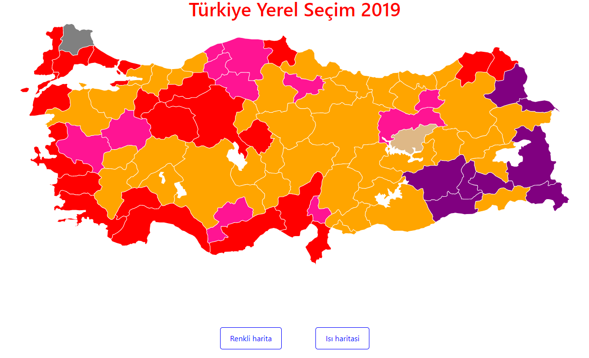
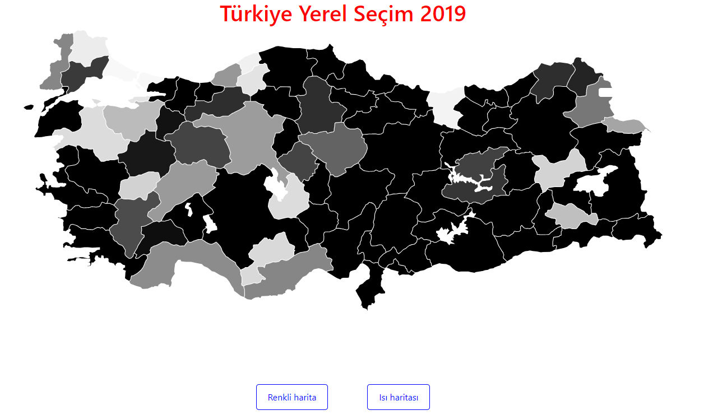

# Election Map

### About Project

Election Map is a react project that shows results of Local Election in Turkey in 2019. 

### How it works

It receives results of Election from a Json File and creates Turkey map that is also received from a Json File. In this project, 2 different types of map can be selected. One of these maps is colors based and another is temperature color based.

### Used technologies

* HTML
* CSS
* Javascript
* React

### `npm start`

Runs the app in the development mode. 
Open [http://localhost:3000](http://localhost:3000) to view it in the browser.

The page will reload if you make edits. 
You will also see any lint errors in the console.

### `npm install`

Installs npm packages. 

### `npm run build`

Builds the app for production to the `build` folder. 
It correctly bundles React in production mode and optimizes the build for the best performance.

